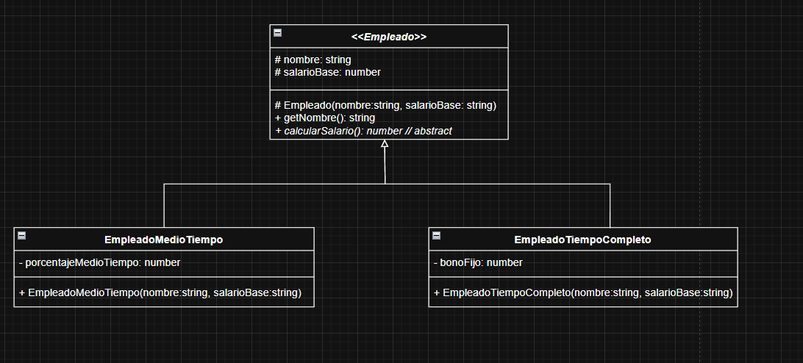

# Programación 4 grupo 8
## Integrantes
- Ismael Cordoba
- Mariana Baradad
- Juan Baranovsky
- Francisco Rios
- Hernan Folik

---

#### UML Ejercicio 3


---

#### UML Eercicio 5


--- 
## Guia instalacion

Instalación dependencias
```
    npm install
```

Ejecutar modo desarrollador
```
    npm run dev
```

Se ejecutaran todos los ejercicios